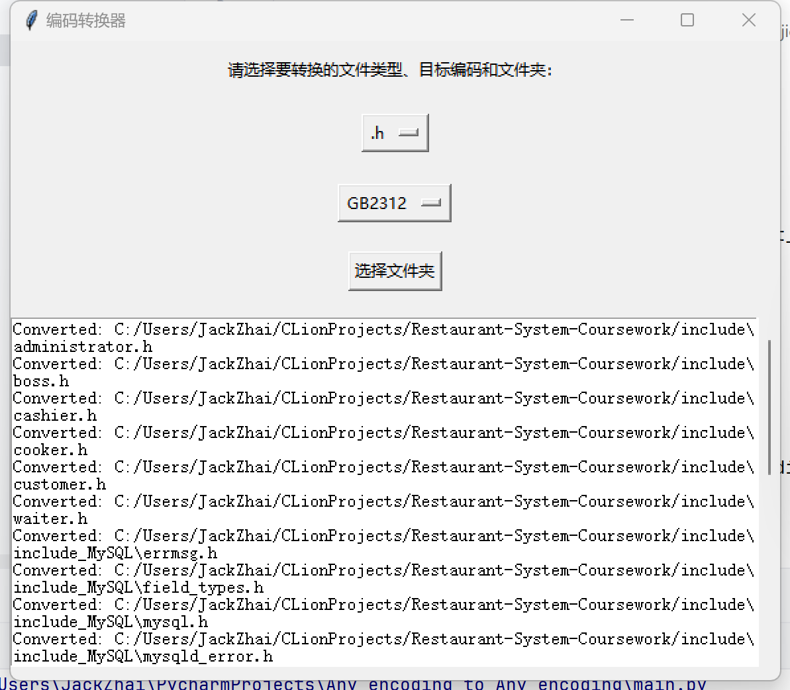

# 编码转换器
## 用于将.h，.cpp，.c，.py，.java后缀的文件编码批量转换为Any_encoding
### .exe可执行文件在dist文件夹下，也可以在IDE直接运行main.py使用
### 有图形化界面

# encoder converter
## Used to batch convert,h.cpp,.c,.py,.java file encodings to Any_encoding
### The.exe executable is in the dist folder or you can use it directly from main.py in your IDE
### Graphical interface
